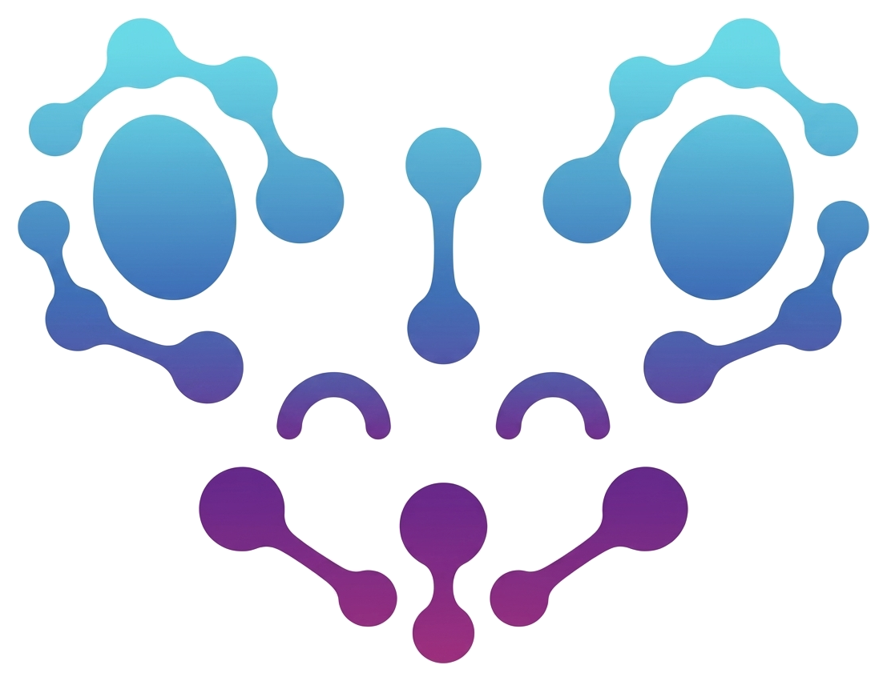

<p align="center">
  <a href="https://brainbench-org.github.io/ibl-bwb-project/"></a>
</p>

<h1 align="center">IBL BrainWideBench</h1>

<p align="center">
  Benchmarking large-scale pretraining and across-animal transfer in multi-region
  neural recordings from the
  <a href="https://www.internationalbrainlab.com/">International Brain Laboratory</a>.
  <br>
  Pretrain on <b>423</b> Neuropixels sessions, then transfer to <b>29</b> held-out
  sessions across <b>11 tasks</b> in <b>3 suites</b>.
  <br>&nbsp;
</p>

<p align="center">
  <a href="https://brainbench-org.github.io/ibl-bwb-project/"></a>
  <a href="https://bwb.iblcore.org"></a>
  <br><br>
  <a href="https://arxiv.org/abs/2609.22064"></a>
  <a href="https://brainbench-org.github.io/ibl-bwb/"></a>
  <a href="https://huggingface.co/collections/nerdslab/ibl-bwb"></a>
  <a href="https://wandb.ai/ibl-bwb/projects"></a>
  <a href="#citation"></a>
</p>

Start with [Setup](https://brainbench-org.github.io/ibl-bwb/guides/setup.html) (install, the
`.env` file, data roots) and
[Dataset](https://brainbench-org.github.io/ibl-bwb/guides/dataset.html) (the two builds,
downloading from S3). Every guide below is on the same
[documentation site](https://brainbench-org.github.io/ibl-bwb/).

## Where things live

| Directory | What it holds | Guide |
|---|---|---|
| [`src/pretrain/`](src/pretrain/) | Pretraining, one directory per model | [Pretraining](https://brainbench-org.github.io/ibl-bwb/guides/pretraining.html) |
| [`src/ts1/`](src/ts1/) | Task Suite 1, decoding behavior and stimulus | [TS1](https://brainbench-org.github.io/ibl-bwb/guides/ts1.html) |
| [`src/ts2/`](src/ts2/) | Task Suite 2, neural activity prediction | [TS2](https://brainbench-org.github.io/ibl-bwb/guides/ts2.html) |
| [`src/ts3/`](src/ts3/) | Task Suite 3, brain region decoding | [TS3](https://brainbench-org.github.io/ibl-bwb/guides/ts3.html) |
| [`src/core/`](src/core/) | Shared machinery: trainer loop, datasets, samplers, checkpointing | [Codebase](https://brainbench-org.github.io/ibl-bwb/guides/overview.html) |
| [`src/ibl_bwb_eval/`](src/ibl_bwb_eval/) | The published scoring contract: tasks, metrics, scoring | [README](src/ibl_bwb_eval/README.md) |
| [`ibl_brain_wide_bench_2026/`](ibl_brain_wide_bench_2026/) | Rebuilding the brainsets from the raw IBL dataset | [README](ibl_brain_wide_bench_2026/README.md) |

## Submitting to the leaderboard

Train your model however you like, then upload its prediction files at
<https://bwb.iblcore.org>. Scoring runs on our server, so you never handle the evaluation
labels. A submission covers at least three seeds.

```bash
python src/ts1/train.py trainer=<your_model> data_root=<path> \
    save_preds.enable=true save_preds.label=<submission-id>
```

You do not open a pull request to appear on the leaderboard, and we do not merge new
baselines. See [CONTRIBUTING.md](CONTRIBUTING.md) for the per-suite prediction paths, how
to add a model without editing anything central, and how to report a problem.

## Acknowledgments

> [!NOTE]
> This project utilizes code from or was influenced by [torch_brain](https://github.com/neuro-galaxy/torch_brain) and [nuclr](https://github.com/nerdslab/nuclr), as well as private code by Vinam Arora and Divyansha Lachi.

## Citation

If you use IBL BrainWideBench, please cite the paper:

```bibtex
@misc{iblbwb2026,
  title         = {BrainWideBench: Benchmarking large-scale pretraining and across-animal transfer in multi-region neural recordings},
  author        = {Alexandre Andre and Shivashriganesh P. Mahato and Vinam Arora and Keshav Balaji and Divyansha Lachi and Nanda H. Krishna and Jingyun Xiao and Yizi Zhang and Ximeng Mao and Wenrui Ma and Han Yu and International Brain Laboratory and Daniel Birman and Niccolò Bonacchi and Gaelle A. Chapuis and Joana A. Catarino and Felicia Davatolhagh and Mayo Faulkner and Laura Freitas-Silva and Fei Hu and Julia M. Huntenburg and Anup Khanal and Inês Laranjeira and Petrina Lau and Guido T. Meijer and Nathaniel J. Miska and Jean-Paul Noel and Alejandro Pan-Vazquez and Georg Raiser and Cyrille Rossant and Karolina Z. Socha and Anne E. Urai and Miles J. Wells and Steven J. West and Olivier Winter and Blake Richards and Guillaume Lajoie and Cole Hurwitz and Mehdi Azabou and Matthew R. Whiteway and Liam Paninski and Eva L. Dyer},
  year          = {2026},
  eprint        = {2609.22064},
  archivePrefix = {arXiv},
  primaryClass  = {cs.LG},
  url           = {https://arxiv.org/abs/2609.22064},
}
```

The benchmark is built on the IBL Brain Wide Map, so please cite the dataset as well:

```bibtex
@article{iblbwm2025,
  title={A brain-wide map of neural activity during complex behaviour},
  author = {IBL and Benson, Brandon and Benson, Julius and Birman, Daniel and Bonacchi, Niccol{\`o} and Carandini, Matteo and Catarino, Joana A and Chapuis, Gaelle A and Churchland, Anne K and Dan, Yang and Dayan, Peter and DeWitt, Eric EJ and Engel, Tatiana A and Fabbri, Michele and Faulkner, Mayo and Fiete, Ila Rani and Findling, Charles and Freitas-Silva, Laura and Ger{\c c}ek, Berk and Harris, Kenneth D and H{\"a}usser, Michael and Hofer, Sonja B and Hu, Fei and Hubert, F{\'e}lix and Huntenburg, Julia M and Khanal, Anup and Krasniak, Christopher and Langdon, Christopher and Lau, Petrina Y P and Mainen, Zachary F and Meijer, Guido T and Miska, Nathaniel J and Mrsic-Flogel, Thomas D and Noel, Jean-Paul and Nylund, Kai and Pan-Vazquez, Alejandro and Pouget, Alexandre and Rossant, Cyrille and Roth, Noam and Schaeffer, Rylan and Schartner, Michael and Shi, Yanliang and Socha, Karolina Z and Steinmetz, Nicholas A and Svoboda, Karel and Urai, Anne E and Wells, Miles J and West, Steven Jon and Whiteway, Matthew R and Winter, Olivier and Witten, Ilana B},
  journal={Nature},
  volume={645},
  number={8079},
  pages={177--191},
  year={2025},
  publisher={Nature Publishing Group UK London},
  url={https://www.nature.com/articles/s41586-025-09235-0},
}
```