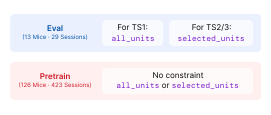

.. _dataset_guide:

Dataset
=======

Every recording comes from the IBL Brain Wide Map :cite:`iblbwm2025`, a
brain-wide survey of Neuropixels activity recorded while mice perform one standardized
decision task across ten laboratories.

The dataset varies along two axes. All files are stored in brainsets HDF5 format.

**Regime** splits the sessions into two disjoint sets:

- **pretrain**: the larger set of sessions, available for learning general representations,
  listed in ``src/core/data/pretrain_recording_ids.txt``.
- **eval**: the sessions that determine benchmark numbers for TS1, TS2, and TS3,
  listed in ``src/ibl_bwb_eval/data/eval_recording_ids.txt``.

**Build** is the units quality filtering baked in the dataset at processing time.

- **all_units**: no filtering. TS1 reports on this build.
- **selected_units**: quality filters applied. TS2 and TS3 require it.

.. _dataset_quickstart:

Quick start
-----------

Download everything with the `AWS CLI
<https://docs.aws.amazon.com/cli/latest/userguide/getting-started-install.html>`_:

.. code-block:: bash

   aws s3 sync s3://brain-wide-bench/brainsets/ ./data/ --no-sign-request

which lands as:

.. raw:: html

   <pre class="bwb-tree">
   data/
   ├── all_units/ibl_brain_wide_bench_2026/
   │             ├── eval/
   │             │   ├── 0802ced5-33a3-405e-8336-b65ebc5cb07c.h5
   │             │   └── ...       # 29 sessions in total
   │             └── pretrain/
   │                 └── ...       # 423 sessions in total
   └── selected_units/ibl_brain_wide_bench_2026/
                      ├── eval/
                      │   └── ...  # the same 29 sessions, fewer units
                      └── pretrain/
                          └── ...  # the same 423 sessions, fewer units
   </pre>

then point the code at it with one ``.env`` line per build: see
:ref:`setup_data_root`.

Everything below is the detail: how the builds differ and how to fetch
less than all of it.

.. _dataset_builds:

Why two builds
--------------

TS2 and TS3 predict quantities attached to individual units: TS2 reconstructs a
held-out neuron's spiking activity, and TS3 classifies a unit's brain region from
its activity. A poorly isolated unit is then a corrupted target or label, not
just a noisy input, so both suites need units that passed **quality control**
(**QC**). TS1 decodes behavior from the whole population, where each unit is only
an input feature and filtering discards signal.

Which filters ran is therefore the critical difference between builds. They are
applied before spike data is saved, so they are baked into the ``.h5`` files and
cannot be changed after the fact without reprocessing.

.. list-table::
   :widths: 20 80
   :header-rows: 1

   * - Filter
     - Effect
   * - ``probe_qc``
     - Keeps only probes with a passing probe QC label. Applied to eval sessions
       only; pretrain sessions keep all probes. For reference, 53% of pretrain
       probes carry a passing label, against 82% of eval probes.
   * - ``firing_rate``
     - Keeps only units with mean firing rate above 1.0 Hz.
   * - ``unit_qc``
     - Keeps only units with a QC label of 1.0 (good units).

**TS1** evaluates decoding from the full unfiltered population: use
``all_units``. Every reported TS1 baseline uses that build. A filtered build
still runs; report the build with your results so the difference in setting is
clear.

**TS2 and TS3** require quality-filtered units for valid evaluation: use
``selected_units``.

**Pretraining** has no requirements.
Models may be pretrained on any data source, with any unit filtering, split
strategy, or supervision signal. This is intentional, as the pretrain
set is meant to support a wide range of research questions, from studying the
effect of scale and curriculum, to exploring different QC and filtering
strategies, to designing custom training objectives for neural representation
learning.

The filters define the population a build *stores*. Task suites may narrow it
further at load time, so ``selected_units`` is not the same thing as the
population TS3 scores on: see :ref:`ts3_unit_qc`.

.. _dataset_context_length:

Variable context
-----------------

Every dataset built on :class:`~core.dataset.IBLBrainWideBench2026` accepts a
``context_length``: the total sampled window, in seconds, bounded by
``MAX_CONTEXT_LENGTH`` (20.0, matching the guaranteed gap between splits, so a
longer window can never reach into a neighboring split's data). It defaults to
1.0 and is stored on the instance as ``context_window``.

Only :class:`~ts1.ts1_dataset.IBLBrainWideBenchTS1` and
:class:`~ts2.ts2_dataset.IBLBrainWideBenchTS2` make it *configurable*: each has a
fixed, trailing window that never moves regardless of ``context_length``, and
``context_length`` is how much extra history precedes it. For TS1 and TS2
``co_smoothing``, that window (``TARGET_WINDOW``, ``COSMOOTH_TARGET_WINDOW``,
1.0s) is exactly what gets scored. TS2 ``forecasting`` scores a smaller, fixed
slice of it instead, ``FORECAST_RATIO`` of ``FORECAST_BASE_WINDOW`` (0.1s), so
it stays a forecast, observed history predicting a future, rather than growing
to cover the whole trailing second as ``context_length`` varies.
``get_sampling_intervals`` is unaffected by any of this: the eval set, which
trials exist and what gets scored, is the same regardless of
``context_length``. The extra history is added per sample, extending the
window backward and clipping to whatever is actually available near a
recording or split boundary, so a submission never loses a trial to a longer
context request.

Every other dataset (pretraining, TS3) just carries the inert default: nothing
about it changes, and nothing needs to. A model that wants its own configurable
window can still route it through the same parameter at construction time, even
outside TS1/TS2; NuCLR's pretraining trainer does exactly this, see
:ref:`pretraining_dataset_choice`.

Writing a model that consumes it
~~~~~~~~~~~~~~~~~~~~~~~~~~~~~~~~

A model reads the configured window size off ``train_dataset.context_window`` in
:meth:`~core.model.BaseModel.link_datasets`. Sizing whatever processes the
*input* to it is always correct, since the data handed back genuinely spans that
many seconds. The part that is easy to get wrong is the **readout**: a dense,
per-input-timestep prediction, one value per position in a grid the size of the
input, silently stops matching the target the moment ``context_length`` grows
past ``TARGET_WINDOW``, since the target only ever covers the trailing scored
window.

Two patterns already in this codebase avoid that:

- **Query the target's own timestamps.** POYO, POYO+ and POSSM place their
  output queries at ``target["timestamps"]``, which is always restricted to
  ``TARGET_WINDOW`` regardless of how much context precedes it, so the model
  never predicts more than the target covers.
- **Fix the output dimension.** RRR's readout dimension is
  ``readout_spec.num_timesteps``, a constant derived from ``TARGET_WINDOW``,
  never from the input length.

A model that does neither, sizing its readout to the full input length, only
works at the default ``context_length``. Several baseline models are exactly
this case, and their ``link_datasets`` carries a comment saying so: an explicit,
permanent limitation, not an oversight to eventually fix generically. Extending
one of them to consume more context means changing the readout, not the
dataset.

Downloading from S3
-------------------

The bucket is laid out as ``brainsets/<build>/ibl_brain_wide_bench_2026/<regime>/``,
so adding path components to the source narrows what you download. It is publicly
readable; ``--no-sign-request`` avoids the need for AWS credentials. The quick
start above takes all of it; each step below takes less.

**One build**, both regimes:

.. code-block:: bash

   # unfiltered, for TS1
   aws s3 sync s3://brain-wide-bench/brainsets/all_units/ ./data/all_units --no-sign-request

   # quality-filtered, for TS2 and TS3
   aws s3 sync s3://brain-wide-bench/brainsets/selected_units/ ./data/selected_units --no-sign-request

**One build and one regime**, shown for
``all_units``, swap the name for the other build:

.. code-block:: bash

   # the 29 benchmark sessions
   aws s3 sync s3://brain-wide-bench/brainsets/all_units/ibl_brain_wide_bench_2026/eval/ \
       ./data/all_units/ibl_brain_wide_bench_2026/eval --no-sign-request

   # the 423 pretraining sessions
   aws s3 sync s3://brain-wide-bench/brainsets/all_units/ibl_brain_wide_bench_2026/pretrain/ \
       ./data/all_units/ibl_brain_wide_bench_2026/pretrain --no-sign-request

**One session**, using a ``<session_id>`` listed in
``src/core/data/<regime>_recording_ids.txt``:

.. code-block:: bash

   aws s3 cp s3://brain-wide-bench/brainsets/<build>/ibl_brain_wide_bench_2026/<regime>/<session_id>.h5 \
       ./data/<build>/ibl_brain_wide_bench_2026/<regime>/ --no-sign-request

   # for example, the first eval session of the all_units build
   aws s3 cp s3://brain-wide-bench/brainsets/all_units/ibl_brain_wide_bench_2026/eval/0802ced5-33a3-405e-8336-b65ebc5cb07c.h5 \
       ./data/all_units/ibl_brain_wide_bench_2026/eval/ --no-sign-request

Whatever you narrow to, the destination has to end in the same
``<build>/ibl_brain_wide_bench_2026/<regime>`` path the source does, since that
is the layout the loader expects.

.. _dataset_lfp:

LFP recordings
--------------

LFP is shipped separately from the spikes/behavior brainsets above, as
``lfpack``-compressed traces (`int-brain-lab/lfpack
<https://github.com/int-brain-lab/lfpack>`_, mild tier: ~270x compression,
~15µV median RMSE). Unlike the ``.h5`` files above, LFP is keyed by **probe
insertion** (``pid``), not by session, since a session can carry more than one
probe:

.. code-block:: bash

   aws s3 cp s3://brain-wide-bench/brainsets/lfp/ibl_brain_wide_bench_2026/<pid>.h5 \
       ./data/lfp/ibl_brain_wide_bench_2026/ --no-sign-request

There is no ``<build>``/``<regime>`` split for LFP: it does not depend on unit
filtering, and the same file serves both pretrain and eval. Coverage matches
the session cohort above (688 of the archive's 1099 recordings fall within
``pretrain_recording_ids.txt``/``eval_recording_ids.txt``; the rest belong to
sessions outside brain-wide-bench and are not shipped).

To find the ``pid``\\(s) for a given session, read the ``probes`` group of that
session's own ``.h5`` file (its ``id`` field lists the session's probe
insertion ids). Decode a shipped file with ``lfpack.LFPackReader``.

.. _dataset_custom_builds:

Custom builds
-------------

The two builds on S3 are not the only ones you can have. Reprocessing the
sessions from raw data with the `brainsets CLI
<https://torch-brain.readthedocs.io/en/latest/cli/commands.html>`_ lets you pick
the filters yourself.

.. code-block:: bash

   # all_units, for TS1 (no unit filters)
   brainsets prepare ./ibl_brain_wide_bench_2026 --local \
       --processed-dir ./data/all_units

   # selected_units, for TS2 and TS3 (all quality filters)
   brainsets prepare ./ibl_brain_wide_bench_2026 --local \
       --processed-dir ./data/selected_units \
       --unit-filter all

   # a custom build, here firing rate only
   brainsets prepare ./ibl_brain_wide_bench_2026 --local \
       --processed-dir ./data/custom \
       --unit-filter firing_rate

``--unit-filter all`` expands to the full set required by TS2 and TS3, and the
individual names (``firing_rate``, ``probe_qc``, ``unit_qc``) can be combined
freely. Any combination other than those two is recorded as a ``custom`` build,
which TS1 accepts with a warning and TS2 and TS3 refuse.

See ``ibl_brain_wide_bench_2026/README.md`` for the full list of pipeline
flags and options.
